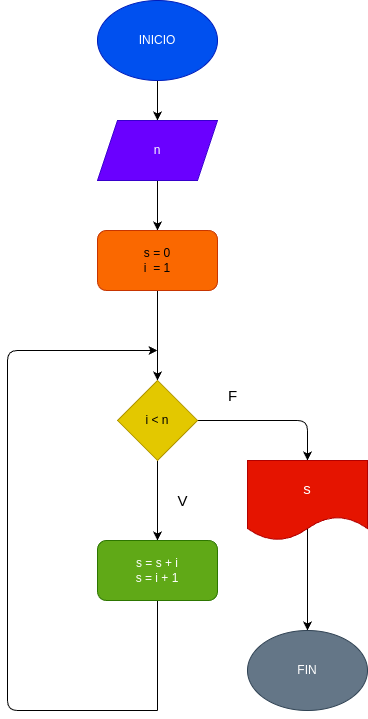

# While_1
suma de los n primeros numeros naturales pero implementando un bucle.

# analisis

## Input 

### variables de entrada 
n: numero al que se desea aplicar la formula.

i: siguiente digito a sumar.

mientras i <= n:

s = s + 1

i = i + 1

### output 
S
# Diseño 

# Construccion 